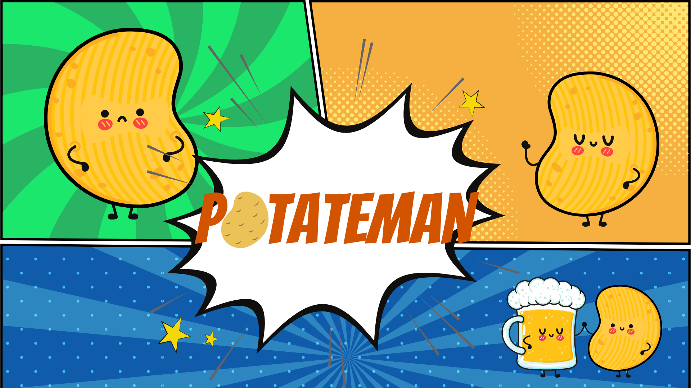

# Patateman

Jeu type Bomberman de fin de module Dev Desktop.

## Site web

http://patateman.noble-coding.com/

## L'équipe

- Alexandre KRAMER
- Nicolas BARBARISI
- Léo MAGNANT
- David CHEONG

## Technologies utilisées

JavaFX avec un JDK 17 (peut marcher avec un JDK 11 mais sans garantie).

## Visuels

**Visuels**

## Prérequis

- IntelliJ IDEA ;
- JDK 17

## Installation

-  `git clone git@github.com:Noble-Coding/Patateman.git`
-  Build le projet
-  Le lancer (le main est `GameApp`)

## Commandes

- **Z, Q, S, D** : avancer, aller à gauche, reculer, aller à droite ;
- **ESPACE** : Poser une bombe ;
- **Echap** : Menu pause

## Gameplay

Le gameplay se décompose en plusieurs points :

- Le personnage qui peut bouger et mettre des bombes qui détruisent les casses brick et tuent les monstres.
- Les monstres qui peuvent bouger et tuer le joueur .
- Des powers up sont disposés sur la map et apportent des bonus ( à vous de les découvrir)
- Il y a 2 niveaux différents
- Et le reste... à vous de le découvrir
- ps: on a tenté de mettre des musiques (ce fût un échec)

## Status du projet

Le projet est opérationnel, cependant la plupart des classes et des fichiers créés ne sont pas implémentés. Il ne s'agit ici que d'une démo de ce qui peut être fait.

## Problèmes rencontrés

- On a tenté de mettre des musiques;
- La page de score ne s'affiche pas;
- L'image du menu principal n'est pas bien centré.

## License

[MIT](https://choosealicense.com/licenses/mit/)

### Les liens importants

- [Jira](https://noble-team.atlassian.net/jira/software/projects/PATMAN/boards/6/roadmap)
- [Site officiel](http://patateman.noble-coding.com/)
